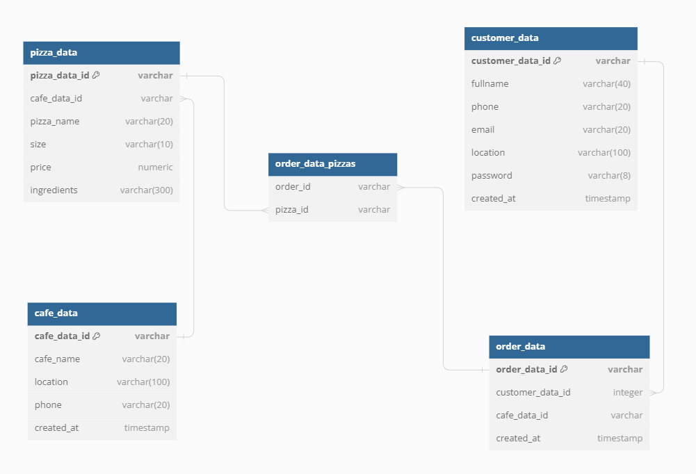

**School/College:**   Tel-Ran.de Gmbh 

**Study Group:**  43_45m

**Student:**  Anita Wolf

1. Project Description and Objectives:
   The "Pizza Cafes" project is being developed to create an application that allows users to find pizzerias and order pizza. Users will be able to search for pizzas by name, view the cafe menu, and place orders within the application.

The main goal of the project is to develop a software solution that optimizes operational processes and provides convenience for users in pizza search.

1. Cafe_data

**Schema**

| Field     | Type                   | NotNull | Properties | Description   |
|-----------|------------------------| ------- |------------|---------------|
| ID        | varchar                | +       | PK,AUTO-INCR | Cafe ID       |
| cafe_name | varchar(30)            |+|            | Cafe name     |
| location  | varchar(100)           |+|            | Cafe location |
| phone     | varchar(20)            |+|            | Cafe phone    |
| created_at | timestamp w/o timezone |+|            |time of data entry into the database.            |

1.1. Get a list of all cafes.

1.2. Get cafe information by ID

1.3  Retrieve a cafe by the name of a specific pizza

1.4 Retrieve a list of pizzas associated with a cafe by its name

1.5. Create a new cafe.

1.6. Delete a cafe by ID

1.7. Update cafe information by ID.

2. Pizza_data

**Schema**

| Field        | Type                   |NotNull| Properties        | Description        |     
|--------------|------------------------| --- |-------------------|--------------------| 
| ID           | varchar                | +   | PK,AUTO-INCR      | Pizza ID           | 
| cafe_data_id | varchar                |+| FK cafe_data =>id |               |
| pizza_name   | varchar(30)            | +   |                   | Pizza name         |       
| price        | numeric                | +   |                   | Pizza price        |     
| size         | varchar (10)           | +   |                   | Pizza Size         |  
| description  | varchar(300)           | +   |                   | Pizza description  |  
| created_at   | timestamp w/o timezone |+|                   |   time of data entry into the database.                 |

2.1. Get a list of all pizzas

2.2. Find all pizzas for a given cafe by its ID.

2.3. Get a pizza by its ID

2.4. Get a pizza by its name

2.5. Create a new pizza

2.6. Delete a pizza by its ID

2.7. Update pizza information.

4. Customer_data

**Schema**

| Field           | Type                   |NotNull| Properties   | Description       |     
|-----------------|------------------------| --- |--------------|-------------------| 
| ID              | varchar                | +   | PK,AUTO-INCR | Customer ID       |     
| fullname        | varchar(40)            | +   |              | Customer name     |       
| phone           | varchar(20)            | +   |              | Customer phone    |     
| email           | varchar(20)            | +   |              | Customer email    |  
| location        | varchar(100)           | +   |              | Customer address  |
| password | varchar(8)             | +   |              | customer password |
| created_at      | timestamp w/o timezone |+|              | time of data entry into the database.                  |

4.1. Get a list of all customers

4.2. Get a customer by name

4.3. Create a new customer

4.4. Delete a customer by  ID

4.5. Update a customer by  ID

5. Order_data

**Schema**

| Field            | Type              |NotNull| Properties           | Description |     
|------------------|-------------------| --- |----------------------|--| 
| ID               | varchar           | +   | PK,AUTO-INCR         | Order ID |     
| customer_data_id | varchar           | +   | FK customer_data=>id |  | 
| cafe_data_id     | varchar           | +   | FK cafe_data=>id     |  | 
| created_at       | timestamp w/o timezone | +   |                      |time of data entry into the database.  |     

6.
   5.1. Get a list of all orders

   5.2. Get an order by its ID

   5.3. Create a new order.

   5.4. Delete an order by its ID.

   5.5. Updates an existing order

7. Order_data_pizzas

**Schema**

| Field    | Type              |NotNull| Properties        | Description |     
|----------|-------------------| --- |-------------------|--| 
| pizza_iD | varchar           | +   | FK pizza_data=>id |  |     
| order_id | varchar           | +   | FK order_data=>id |  |       
  

Operations/Functions:

1. Selecting a café and viewing pizzas
2. Selecting a pizza

